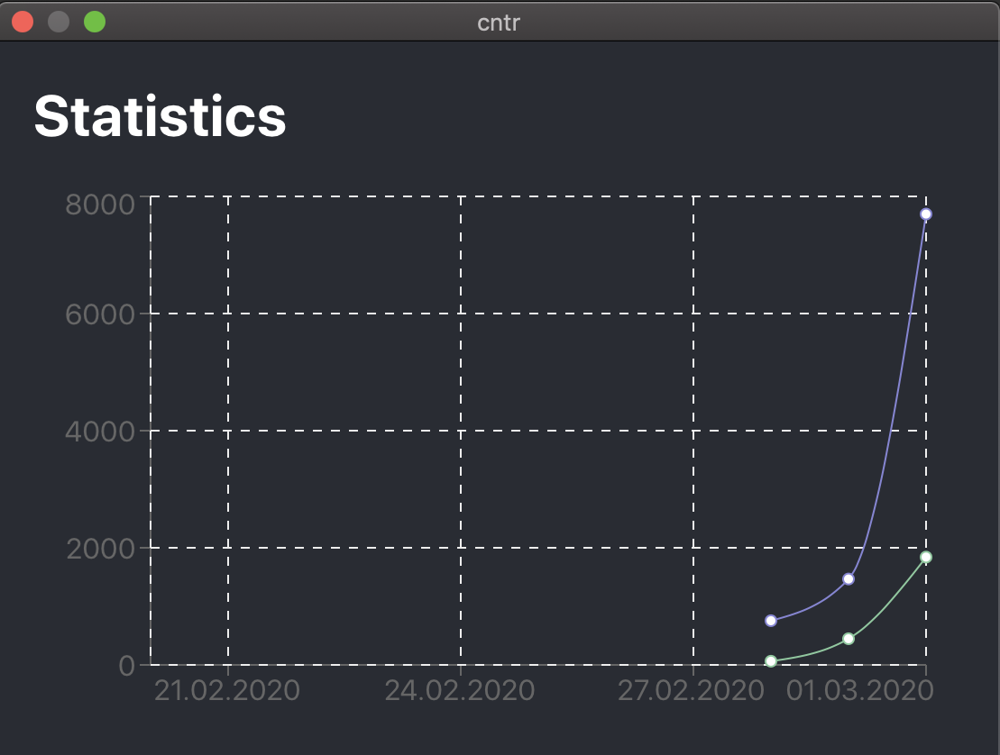

# Cntr

This is a simple key counter widget for your system tray. It could be an open source alternative to your WhatPulse client. It's wip.

**supported platforms**: `macos`  
**support in porgress**: `windows`, `linux`  




## Build

Currently there is only a build script for mac os available:

```
git clone https://github.com/meinto/cntr.git
cd cntr
./build.sh
open ./dist
```

## Contribution

Contributions are welcome. :)